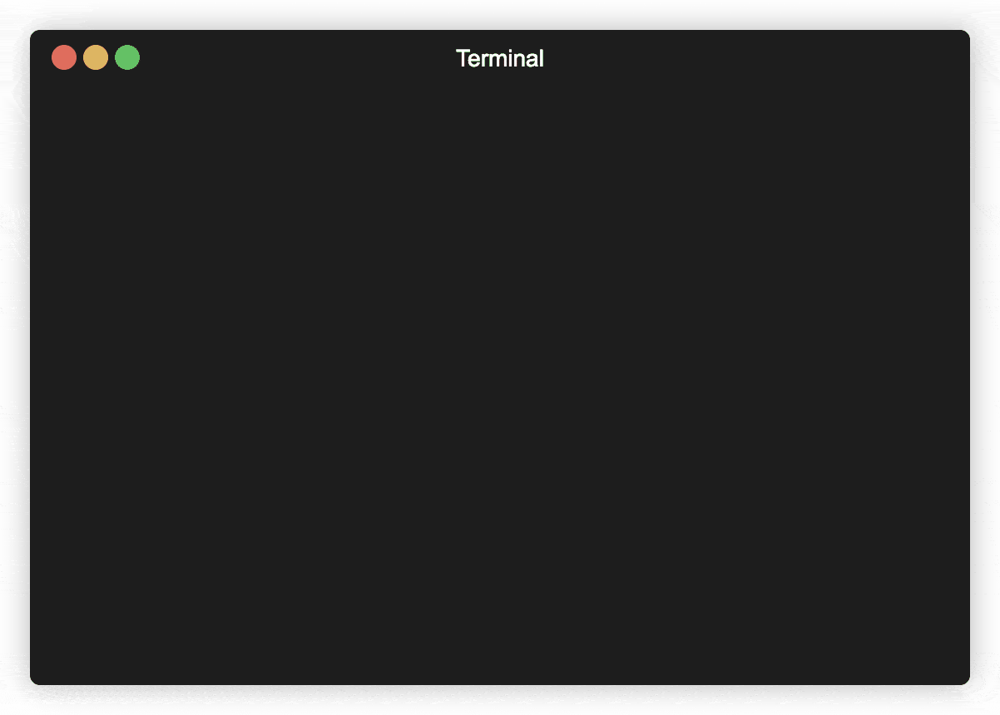
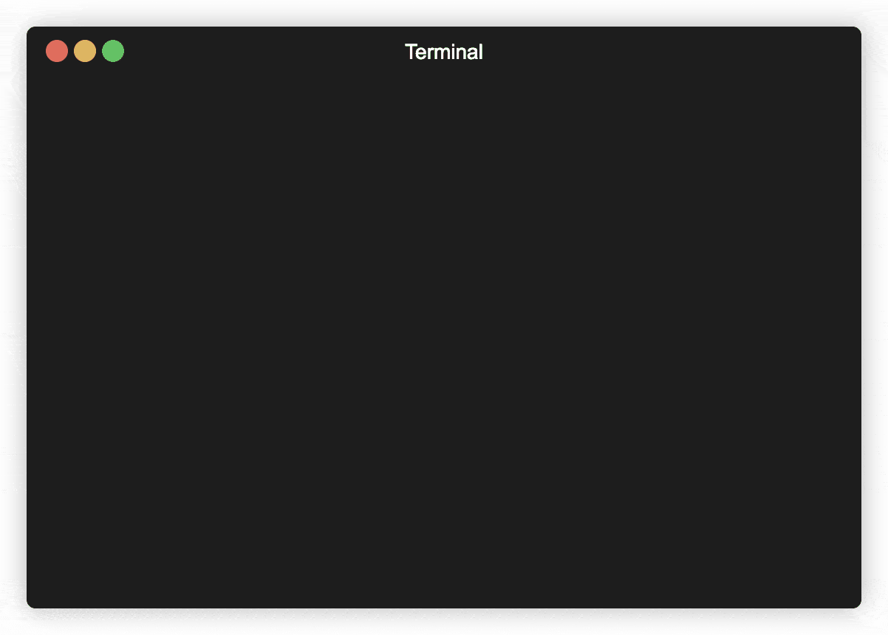
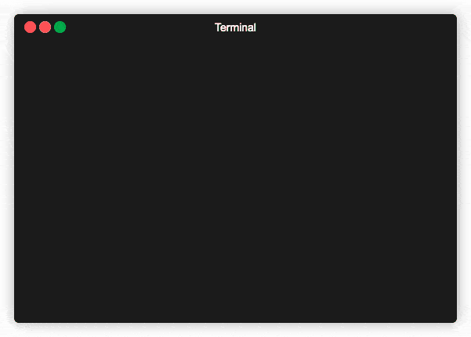
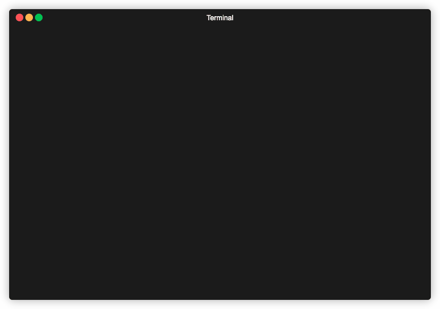
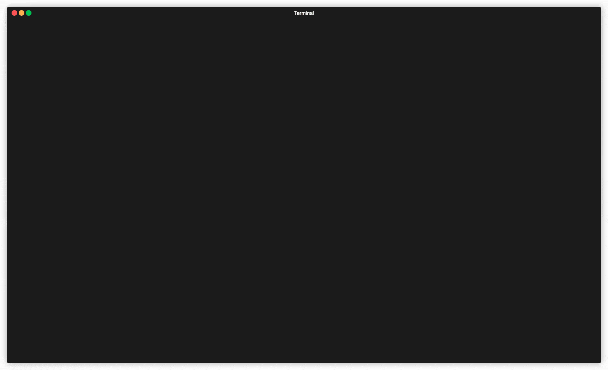

<br /><br /><br />
<p align="center">
  
</p>
<br /><br />

# modbus-browser
A Modbus TCP browser application as a command-line client.

[](https://deepsource.io/gh/HQarroum/modbus-browser/?ref=repository-badge)

Current version: **1.0.0**

## 📋 Table of content

- [Installation](#-install)
- [Features](#-features)
- [Usage](#-usage)
- [See also](#-see-also)

## 🚀 Install

If you would like to use this tool as a global command-line client on your computer, run the below command.

```bash
npm install modbus-browser --global
```

## 🔖 Features

- Includes a Modbus TCP compliant browser as a command-line client.
- The CLI includes an interactive terminal browser allowing to browse different dimensions of a Modbus server.
- Interactive dashboard that allows you to interactively discover the register values on the Modbus server.
- Useful for testing and prototyping with Modbus TCP clients against industrial devices.

## 🛠 Usage

The Modbus command-line client can be [globally installed](#install) on your computer and allows you to query different types of registers on a remote Modbus TCP server. You can specify the host, port and unit identifier to use as part of the connection as well as the type of register (e.g coils, discrete inputs, etc.) and the mode (read or write).

Below is a description of the different commands you can use with the Modbus browser command-line client.

### Describing commands and options

After installing this package, you can run the `modbus-browser` command to list all of the commands it implements along with their description.

<br />
<p align="center">
  
</p>
<br />

#### Options

- `-h, --help` - Displays the help menu for this command.

### `read-coils`

The `read-coils` command can output a hexadecimal dump of the given amount of coils located at a given address on the remote server.

<br />
<p align="center">
  
</p>
<br />

#### Example

```bash
modbus-browser read-coils \
  --server <hostname> \
  --port 502
  --start-address 1
  --count 64
```

#### Options

- `-s, --server <hostname>` - The hostname or IP address of the Modbus server to initiate a connection to.
- `-p, --port <port>` - The port of the Modbus server to initiate a connection to (set to `502` by default).
- `-u, --unit-id <unitId>` - The unit identifier to perform the action on (set to `1` by default).
- `-a, --start-address <address>` - The start address of the coil(s) to be read.
- `-c, --count <count>` - The amount of **bits** to be read.
- `-m, --monitor` - Causes the `mobus-browser` to continuously monitor the coils at the given address.
- `-i, --interval <interval>` - Specifies the interval in milliseconds at which `mobus-browser` is continuously dumping the coils values when monitoring is enabled.
- `-h, --help` - Displays the help menu for this command.

### `read-holding-registers`

The `read-holding-registers` command can output a hexadecimal dump of the given amount of holding registers located at a given address on the remote server.

<br />
<p align="center">
  
</p>
<br />

#### Example

```bash
modbus-browser read-holding-registers \
  --server <hostname> \
  --port 502
  --start-address 40001
  --count 64
```

#### Options

- `-s, --server <hostname>` - The hostname or IP address of the Modbus server to initiate a connection to.
- `-p, --port <port>` - The port of the Modbus server to initiate a connection to (set to `502` by default).
- `-u, --unit-id <unitId>` - The unit identifier to perform the action on (set to `1` by default).
- `-a, --start-address <address>` - The start address of the holding register(s) to be read.
- `-c, --count <count>` - The amount of **bytes** to be read.
- `-m, --monitor` - Causes the `mobus-browser` to continuously monitor the holding registers values at the given address.
- `-i, --interval <interval>` - Specifies the interval in milliseconds at which `mobus-browser` is continuously dumping the holding registers values when monitoring is enabled.
- `-h, --help` - Displays the help menu for this command.

### `read-discrete-inputs`

The `read-discrete-inputs` command can output a hexadecimal dump of the given amount of inputs located at a given address on the remote server.

<br />
<p align="center">
  
</p>
<br />

#### Example

```bash
modbus-browser read-discrete-inputs \
  --server <hostname> \
  --port 502
  --start-address 40001
  --count 64
```

#### Options

- `-s, --server <hostname>` - The hostname or IP address of the Modbus server to initiate a connection to.
- `-p, --port <port>` - The port of the Modbus server to initiate a connection to (set to `502` by default).
- `-u, --unit-id <unitId>` - The unit identifier to perform the action on (set to `1` by default).
- `-a, --start-address <address>` - The start address of the discrete input(s) to be read.
- `-c, --count <count>` - The amount of **bits** to be read.
- `-m, --monitor` - Causes the `mobus-browser` to continuously monitor the discrete input values at the given address.
- `-i, --interval <interval>` - Specifies the interval in milliseconds at which `mobus-browser` is continuously dumping the discrete input values when monitoring is enabled.
- `-h, --help` - Displays the help menu for this command.

### `read-input-registers`

The `read-input-registers` command can output a hexadecimal dump of the given amount of inputs located at a given address on the remote server.

<br />
<p align="center">
  
</p>
<br />

#### Example

```bash
modbus-browser read-input-registers \
  --server <hostname> \
  --port 502
  --start-address 40001
  --count 64
```

#### Options

- `-s, --server <hostname>` - The hostname or IP address of the Modbus server to initiate a connection to.
- `-p, --port <port>` - The port of the Modbus server to initiate a connection to (set to `502` by default).
- `-u, --unit-id <unitId>` - The unit identifier to perform the action on (set to `1` by default).
- `-a, --start-address <address>` - The start address of the input register(s) to be read.
- `-c, --count <count>` - The amount of **bytes** to be read.
- `-m, --monitor` - Causes the `mobus-browser` to continuously monitor the input register values at the given address.
- `-i, --interval <interval>` - Specifies the interval in milliseconds at which `mobus-browser` is continuously dumping the input register values when monitoring is enabled.
- `-h, --help` - Displays the help menu for this command.

### `dashboard`

The `dashboard` command opens an interactive browser in your terminal allowing you to browse values associated with different Modbus registers.

<br />
<p align="center">
  
</p>
<br />

#### Example

```bash
modbus-browser dashboard \
  --server <hostname> \
  --port 502
```

#### Options

- `-s, --server <hostname>` - The hostname or IP address of the Modbus server to initiate a connection to.
- `-p, --port <port>` - The port of the Modbus server to initiate a connection to (set to `502` by default).
- `-u, --unit-id <unitId>` - The unit identifier to perform the action on (set to `1` by default).
- `-h, --help` - Displays the help menu for this command.

## 👀 See also

- The [node-modbus](https://github.com/Cloud-Automation/node-modbus) library documentation used by the `modbus-browser` command-line client.
